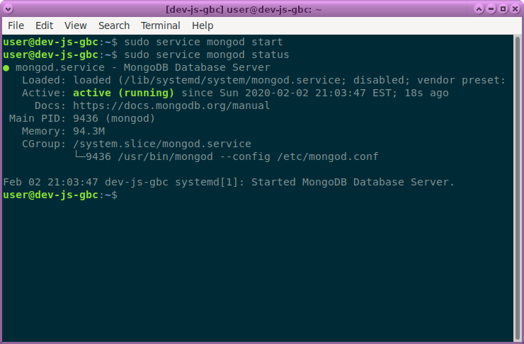
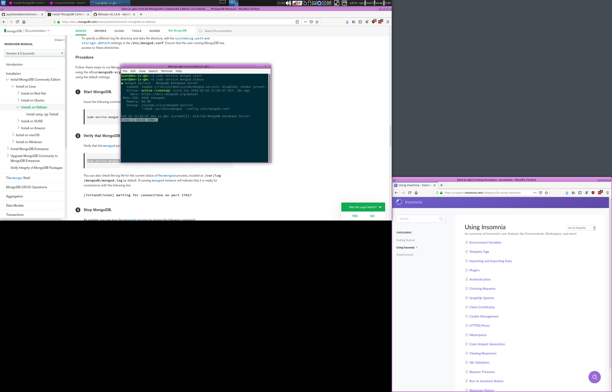
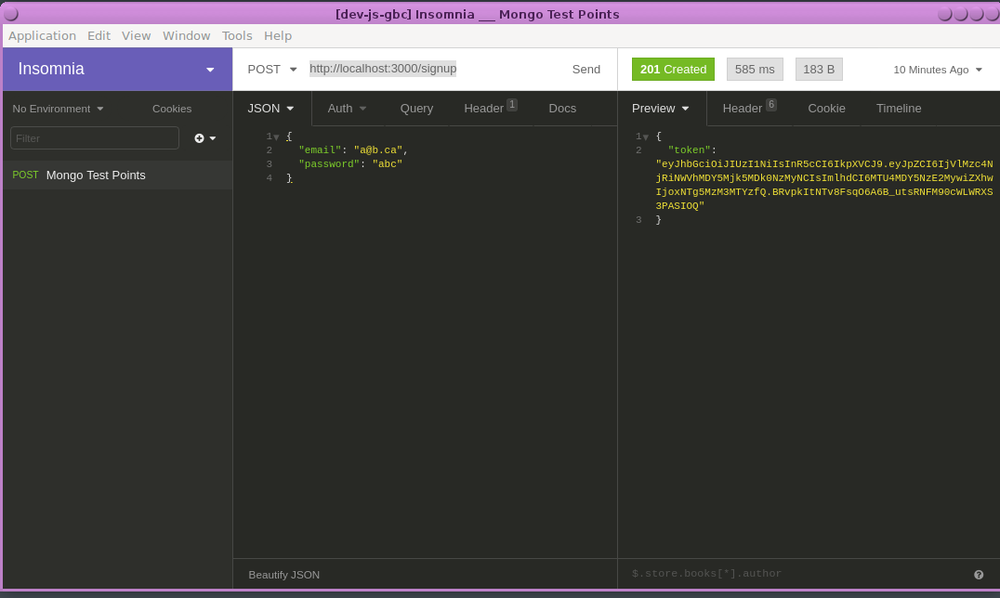

# mongo-example

# Install Mongo Or Use A Container
[docs here](https://docs.mongodb.com/manual/tutorial/install-mongodb-on-debian/).

> Very Important: Have Mongo installed on your machine for continuing. 







## Install Your Deps
`npm install`

## Build your application
`npm run build`

## Start The App
`npm run start`

## Authenticate
`POST http://localhost:3000/signup`

```json
{
  "email": "a@b.ca",
  "password": "chooseone"
}
```

> After sending the signup payload, you've been authed

You should see a response containing the token



We can now access endpoints previously unavailable using the aforementioned JSON Web Tokens(JWT).

The user name and password you entered in the JSON payload that was sent to the `/signup` endpoint created your credentials in the database.

We'll be using [Azures CosmosDB](https://github.com/microsoft/vscode-cosmosdb) to navigatethe mongo db but of course, this can also be done through the commnad line.